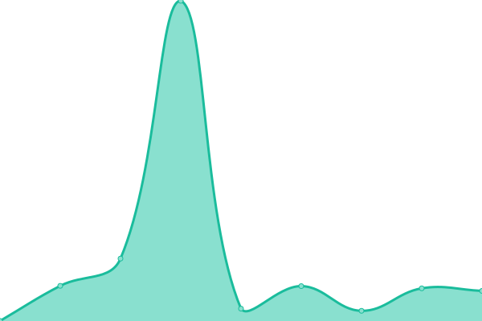

# [📈 Live Status](https://demo.upptime.js.org): <!--live status--> **🟧 Partial outage**

This repository contains the open-source uptime monitor and status page for [DjonysDalmy](https://demo.upptime.js.org), powered by [Upptime](https://github.com/upptime/upptime).

With [Upptime](https://upptime.js.org), you can get your own unlimited and free uptime monitor and status page, powered entirely by a GitHub repository. We use [Issues](https://github.com/DjonysDalmy/status-ibrep/issues) as incident reports, [Actions](https://github.com/DjonysDalmy/status-ibrep/actions) as uptime monitors, and [Pages](https://demo.upptime.js.org) for the status page.

<!--start: status pages-->
<!-- This summary is generated by Upptime (https://github.com/upptime/upptime) -->
<!-- Do not edit this manually, your changes will be overwritten -->
<!-- prettier-ignore -->
| URL | Status | History | Response Time | Uptime |
| --- | ------ | ------- | ------------- | ------ |
|  [Site IBREP](https://ibrep.com.br) | Ok | [site-ibrep.yml](https://github.com/DjonysDalmy/status-ibrep/commits/HEAD/history/site-ibrep.yml) | 

 5770ms
     
 | 

<a href="https://status.grupoibrep.com/history/site-ibrep">100.00%</a>
    

|  [API Site IBREP](https://ibrep.com.br/api/ibrep/public/index.php/) | Ok | [api-site-ibrep.yml](https://github.com/DjonysDalmy/status-ibrep/commits/HEAD/history/api-site-ibrep.yml) | 

 269ms
     
 | 

<a href="https://status.grupoibrep.com/history/api-site-ibrep">100.00%</a>
    

|  [APP IBREP](https://app.ibrep.com.br) | Ok | [app-ibrep.yml](https://github.com/DjonysDalmy/status-ibrep/commits/HEAD/history/app-ibrep.yml) | 

 282ms
     
 | 

<a href="https://status.grupoibrep.com/history/app-ibrep">100.00%</a>
    

|  [Checkout IBREP](https://checkout.ibrep.com.br) | Ok | [checkout-ibrep.yml](https://github.com/DjonysDalmy/status-ibrep/commits/HEAD/history/checkout-ibrep.yml) | 

 122ms
     
 | 

<a href="https://status.grupoibrep.com/history/checkout-ibrep">100.00%</a>
    

|  [Oráculo IBREP - Aluno](https://ibrep.alfamaoraculo.com.br/aluno/) | Ok | [oraculo-ibrep-aluno.yml](https://github.com/DjonysDalmy/status-ibrep/commits/HEAD/history/oraculo-ibrep-aluno.yml) | 

 303ms
     
 | 

<a href="https://status.grupoibrep.com/history/oraculo-ibrep-aluno">99.31%</a>
    

|  [Oráculo IBREP - Gestor](https://ibrep.alfamaoraculo.com.br/gestor/) | Ok | [oraculo-ibrep-gestor.yml](https://github.com/DjonysDalmy/status-ibrep/commits/HEAD/history/oraculo-ibrep-gestor.yml) | 

 71ms
     
 | 

<a href="https://status.grupoibrep.com/history/oraculo-ibrep-gestor">100.00%</a>
    

|  [Oráculo IBREP - Vendedor](https://ibrep.alfamaoraculo.com.br/vendedor/) | Ok | [oraculo-ibrep-vendedor.yml](https://github.com/DjonysDalmy/status-ibrep/commits/HEAD/history/oraculo-ibrep-vendedor.yml) | 

 75ms
     
 | 

<a href="https://status.grupoibrep.com/history/oraculo-ibrep-vendedor">100.00%</a>
    

|  [Oráculo IBREP - Professor](https://ibrep.alfamaoraculo.com.br/professor/) | Ok | [oraculo-ibrep-professor.yml](https://github.com/DjonysDalmy/status-ibrep/commits/HEAD/history/oraculo-ibrep-professor.yml) | 

 75ms
     
 | 

<a href="https://status.grupoibrep.com/history/oraculo-ibrep-professor">100.00%</a>
    

|  [Site IBREPTRAN](https://ibreptran.ibrep.com.br/) | Ok | [site-ibreptran.yml](https://github.com/DjonysDalmy/status-ibrep/commits/HEAD/history/site-ibreptran.yml) | 

 2947ms
     
 | 

<a href="https://status.grupoibrep.com/history/site-ibreptran">100.00%</a>
    

|  [Oráculo IBREPTRAN - Aluno](https://ibreptran.alfamaoraculo.com.br/aluno/) | Ok | [oraculo-ibreptran-aluno.yml](https://github.com/DjonysDalmy/status-ibrep/commits/HEAD/history/oraculo-ibreptran-aluno.yml) | 

 964ms
     
 | 

<a href="https://status.grupoibrep.com/history/oraculo-ibreptran-aluno">99.05%</a>
    

|  [Oráculo IBREPTRAN - Gestor](https://ibreptran.alfamaoraculo.com.br/gestor/) | Ok | [oraculo-ibreptran-gestor.yml](https://github.com/DjonysDalmy/status-ibrep/commits/HEAD/history/oraculo-ibreptran-gestor.yml) | 

 214ms
     
 | 

<a href="https://status.grupoibrep.com/history/oraculo-ibreptran-gestor">99.05%</a>
    

|  [Oráculo IBREPTRAN - CFC](https://ibreptran.alfamaoraculo.com.br/cfc/) | Ok | [oraculo-ibreptran-cfc.yml](https://github.com/DjonysDalmy/status-ibrep/commits/HEAD/history/oraculo-ibreptran-cfc.yml) | 

 226ms
     
 | 

<a href="https://status.grupoibrep.com/history/oraculo-ibreptran-cfc">99.06%</a>
    

|  [Oráculo IBREPTRAN - Atendente](https://ibreptran.alfamaoraculo.com.br/atendente/) | Ok | [oraculo-ibreptran-atendente.yml](https://github.com/DjonysDalmy/status-ibrep/commits/HEAD/history/oraculo-ibreptran-atendente.yml) | 

 219ms
     
 | 

<a href="https://status.grupoibrep.com/history/oraculo-ibreptran-atendente">99.06%</a>
    

|  [Oráculo IBREPTRAN - Professor](https://ibreptran.alfamaoraculo.com.br/professor/) | Ok | [oraculo-ibreptran-professor.yml](https://github.com/DjonysDalmy/status-ibrep/commits/HEAD/history/oraculo-ibreptran-professor.yml) | 

 285ms
     
 | 

<a href="https://status.grupoibrep.com/history/oraculo-ibreptran-professor">99.07%</a>
    

|  [Site ICETRAN](https://icetran.com.br) | Ok | [site-icetran.yml](https://github.com/DjonysDalmy/status-ibrep/commits/HEAD/history/site-icetran.yml) | 

 2908ms
     
 | 

<a href="https://status.grupoibrep.com/history/site-icetran">100.00%</a>
    

|  [Legacy API ICETRAN](https://www.api.icetran.com.br) | Fora do ar | [legacy-api-icetran.yml](https://github.com/DjonysDalmy/status-ibrep/commits/HEAD/history/legacy-api-icetran.yml) | 

 1262ms
     
 | 

<a href="https://status.grupoibrep.com/history/legacy-api-icetran">99.39%</a>
    

|  [Oráculo ICETRAN - Aluno](https://icetran.alfamaoraculo.com.br/aluno/) | Ok | [oraculo-icetran-aluno.yml](https://github.com/DjonysDalmy/status-ibrep/commits/HEAD/history/oraculo-icetran-aluno.yml) | 

 703ms
     
 | 

<a href="https://status.grupoibrep.com/history/oraculo-icetran-aluno">98.78%</a>
    

|  [Oráculo ICETRAN - Gestor](https://icetran.alfamaoraculo.com.br/gestor/) | Ok | [oraculo-icetran-gestor.yml](https://github.com/DjonysDalmy/status-ibrep/commits/HEAD/history/oraculo-icetran-gestor.yml) | 

 225ms
     
 | 

<a href="https://status.grupoibrep.com/history/oraculo-icetran-gestor">98.80%</a>
    

|  [Oráculo ICETRAN - CFC](https://icetran.alfamaoraculo.com.br/cfc/) | Ok | [oraculo-icetran-cfc.yml](https://github.com/DjonysDalmy/status-ibrep/commits/HEAD/history/oraculo-icetran-cfc.yml) | 

 226ms
     
 | 

<a href="https://status.grupoibrep.com/history/oraculo-icetran-cfc">98.82%</a>
    

|  [Oráculo ICETRAN - Atendente](https://icetran.alfamaoraculo.com.br/atendente/) | Ok | [oraculo-icetran-atendente.yml](https://github.com/DjonysDalmy/status-ibrep/commits/HEAD/history/oraculo-icetran-atendente.yml) | 

 214ms
     
 | 

<a href="https://status.grupoibrep.com/history/oraculo-icetran-atendente">99.09%</a>
    

|  [Oráculo ICETRAN - Professor](https://icetran.alfamaoraculo.com.br/professor/) | Ok | [oraculo-icetran-professor.yml](https://github.com/DjonysDalmy/status-ibrep/commits/HEAD/history/oraculo-icetran-professor.yml) | 

 401ms
     
 | 

<a href="https://status.grupoibrep.com/history/oraculo-icetran-professor">99.25%</a>
    

|  [API Detran RS](https://mgfc.detran.rs.gov.br/gfc/rest/gfcmobile/cursoEAD/validaAluno) | Ok | [api-detran-rs.yml](https://github.com/DjonysDalmy/status-ibrep/commits/HEAD/history/api-detran-rs.yml) | 

 1302ms
     
 | 

<a href="https://status.grupoibrep.com/history/api-detran-rs">100.00%</a>
    

|  [API Detran MT](http://ws.detrannet.mt.gov.br:8080/wsEventoCurso/wsEventoCurso.asmx) | Ok | [api-detran-mt.yml](https://github.com/DjonysDalmy/status-ibrep/commits/HEAD/history/api-detran-mt.yml) | 

 1187ms
     
 | 

<a href="https://status.grupoibrep.com/history/api-detran-mt">100.00%</a>
    

<!--end: status pages-->

[**Visit our status website →**](https://status.grupoibrep.com/)

## 📄 License

- Powered by: [Upptime](https://github.com/upptime/upptime)
- Code: [MIT](./LICENSE) © [DjonysDalmy](https://demo.upptime.js.org)
- Data in the `./history` directory: [Open Database License](https://opendatacommons.org/licenses/odbl/1-0/)
